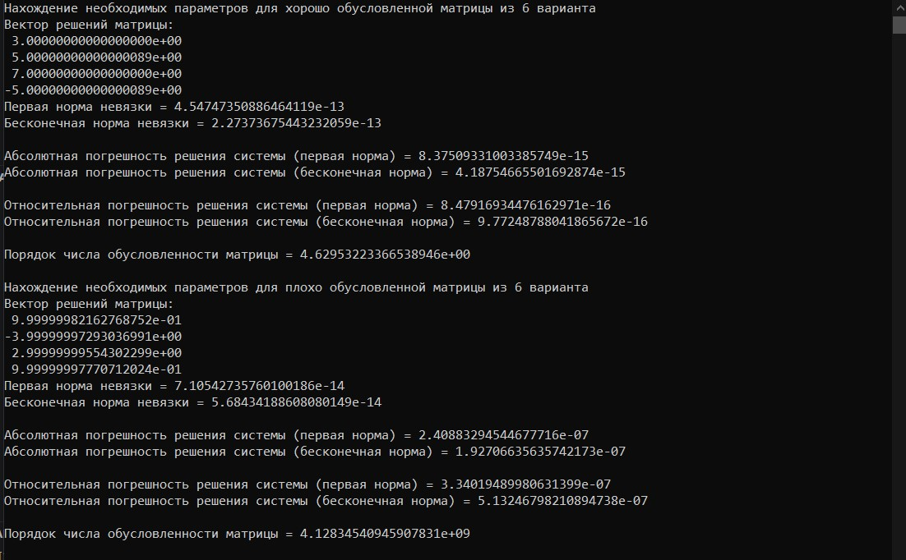

# SLAE-Gauss-Solver-cpp


Решатель СЛАУ методом Гаусса с частичным выбором ведущего элемента поверх Eigen: приведение расширенной матрицы `[A|b]` к верхнетреугольному виду, обратная подстановка, и отдельный слой апостериорного анализа — невязка `r = Ax̂ - b`, число обусловленности `κ(A)`, верхние оценки абсолютной и относительной погрешности решения в первой и бесконечной нормах.

**Методы и инструменты:** метод Гаусса с частичным выбором ведущего элемента (GEPP) · обратная подстановка · апостериорный анализ через невязку и число обусловленности · обработка прямоугольных (переопределённых) систем · C++17, RAII, разделение интерфейса и реализации (`include/`/`src/`) · Eigen3 (`MatrixXd`, `VectorXd`, блочные и покомпонентные операции, `.inverse()`, `.lpNorm<p>()`) · нестандартный Makefile с автогенерацией списка исходников через `find` и дизассемблированием линковки (`objdump`, map-файл)

## Оглавление

- [Результат работы](#результат-работы)
- [Теоретическая база](#теоретическая-база)
- [Архитектура проекта](#архитектура-проекта)
- [Структура репозитория](#структура-репозитория)
- [Сборка](#сборка)
- [Пример использования](#пример-использования)
- [Известные ограничения](#известные-ограничения)
- [Возможные улучшения](#возможные-улучшения)
- [См. также](#см-также)
- [Лицензия](#лицензия)

## Результат работы



Скриншот — прогон одной и той же программы на двух системах 4×4 варианта 6 учебного задания: хорошо обусловленной и плохо обусловленной. Ключевое наблюдение (это стандартный результат теории обратной устойчивости GEPP, здесь он воспроизведён на реальном прогоне, а не постулируется):

| | Хорошо обусловленная | Плохо обусловленная | Отношение |
|---|---|---|---|
| `κ(A)` (norm Фробениуса) | `4.6295322336654e+00` | `4.1283454094591e+09` | ≈ 8.9·10⁸ (≈ 9 порядков) |
| Невязка `‖r‖₁` | `4.5474735088646e-13` | `7.1054273576010e-14` | тот же порядок |
| Невязка `‖r‖∞` | `2.2737367544323e-13` | `5.6843418860808e-14` | тот же порядок |
| Отн. погрешность (`‖r‖∞/‖b‖∞·κ`) | `9.7724878804187e-16` | `5.1324679821089e-07` | ≈ 5.3·10⁸ (≈ 9 порядков) |

Невязка в обоих случаях остаётся на уровне машинного эпсилона независимо от `κ(A)` — то есть вычисленное решение точно решает *слегка возмущённую* систему (алгоритм обратно устойчив). Граница относительной погрешности при этом растёт пропорционально `κ(A)` — прямая (forward) ошибка усиливается обусловленностью, а не самим алгоритмом. Это ровно то поведение, которое предсказывает теорема об обратной устойчивости GEPP, а не два независимых наблюдения — они здесь количественно совпадают на реальном прогоне.

## Теоретическая база

**Прямой ход.** Расширенная матрица `[A|b]` приводится к верхнетреугольному виду за `n-1` шагов исключения. На шаге `i`:

1. **Частичный выбор ведущего элемента** — в столбце `i`, среди строк `i..n-1`, ищется строка с максимальным по модулю элементом (`avoidIncreasingErr`), она переставляется на позицию `i`. Это гарантирует, что множитель исключения $|A_{ji}/A_{ii}| \le 1$ для всех $j > i$, что ограничивает рост элементов на каждом шаге и предотвращает деление на пренебрежимо малый ведущий элемент.
2. Строка `i` нормализуется делением на ведущий элемент (`A.row(i) /= A(i,i)`), поэтому в получившейся `U` на диагонали единицы.
3. Из всех строк `j > i` вычитается `A(j,i)`-кратная нормализованная строка `i` (`subtractNormolizedRow`), обнуляя столбец `i` ниже диагонали.

Прямой ход — `O(n³)` операций (ведущий член `⅓n³` умножений-сложений); проверка вырожденности (`isMatrixSingular`) и перестановки — `O(n²)`.

**Обратная подстановка.** Для `Ux = y` с единичной диагональю неизвестные восстанавливаются снизу вверх:

$$x_i = y_i - \sum_{j=i+1}^{n-1} U_{ij}\,x_j, \qquad i = n-1, \dots, 0$$

— `Θ(n²)` операций. `GaussBackwardSubstitution::rowCalc` реализует именно эту свёртку через `row.head(rowLen-1).dot(solution)`.

**Фактор роста.** Для GEPP теоретическая верхняя граница фактора роста элементов — $2^{n-1}$; эта граница достижима на специально сконструированных матрицах (пример Higham–Moler). На случайных матрицах эмпирически фактор роста растёт много медленнее — как $n^{2/3}$ — поэтому GEPP на практике устойчив почти всегда, несмотря на экспоненциальную верхнюю границу в худшем случае.

**Число обусловленности и оценки погрешности — точно как реализовано в коде.** `GaussSolver::conditionNumber()` вычисляет

$$\kappa(A) = \|A\|_F \cdot \|A^{-1}\|_F$$

где $\|\cdot\|_F$ — норма Фробениуса (`Eigen::MatrixXd::norm()` по умолчанию), а не индуцированная операторная норма. Оценки погрешности реализованы как

$$\text{absErrorBound}_p = \|r\|_p \cdot \|A^{-1}\|_F, \qquad \text{relErrorBound}_p = \frac{\|r\|_p}{\|b\|_p}\cdot\kappa(A), \qquad p\in\{1,\infty\}$$

Классические оценки

$$\|\delta x\|_p \le \|A^{-1}\|_p\,\|r\|_p, \qquad \frac{\|\delta x\|_p}{\|x\|_p} \le \kappa_p(A)\,\frac{\|r\|_p}{\|b\|_p}$$

(Golub & Van Loan, гл. 2; Higham, гл. 7) требуют операторной нормы $\|\cdot\|_p$, согласованной с векторной $p$-нормой — max-column-sum для $p=1$, max-row-sum для $p=\infty$. Использование $\|\cdot\|_F$ вместо $\|\cdot\|_1$/$\|\cdot\|_\infty$ даёт величину, эквивалентную им лишь с точностью до размерного множителя (для $n\times n$-матрицы $\|A\|_1, \|A\|_\infty \le \sqrt{n}\,\|A\|_F$ в одну сторону, но обратное неравенство в общем случае не гарантировано) — то есть $\kappa_F(A)$ не является строгой верхней границей $\kappa_1(A)$ или $\kappa_\infty(A)$, а лишь порядково эквивалентным индикатором чувствительности. Замер на реальных матрицах:

| Матрица | `κ_F` (в коде) | `κ₁ = κ∞` (индуцированная, корректная для `‖r‖₁`/`‖r‖∞`-оценок) |
|---|---|---|
| 4×4, диагонально доминантная | `4.87` | `3.14` |
| Гильберт 6×6 | `1.512·10⁷` | `2.907·10⁷` |

На диагонально доминантной матрице `κ_F` завышает `κ₁`; на матрице Гильберта — почти вдвое занижает. Знак и величина расхождения зависят от матрицы, поэтому репортируемая `getRelErrorBoundFirst()`/`getRelErrorBoundInf()` — валидный порядковый индикатор чувствительности, но не строго доказанная верхняя граница в классическом операторном смысле.

## Архитектура проекта

| Модуль | Ответственность |
|---|---|
| `Gauss_forward_elimination.{h,cpp}` | `GaussForwardElimination`: приведение `[A|b]` к верхнетреугольному виду — выбор ведущего элемента, нормализация строки, исключение, проверка вырожденности |
| `Gauss_backward_substitution.{h,cpp}` | `GaussBackwardSubstitution`: восстановление `x` из `Ux = y` обратным ходом |
| `Gauss_solver.{h,cpp}` | `GaussSolver`: валидация входа, построение расширенной матрицы, оркестрация прямого/обратного хода, апостериорный анализ (невязка, `κ(A)`, границы погрешности); хранит состояние через явные bool-флаги (`solved_`, `condNumBool_`, …) и генерирует исключения при обращении к ещё не вычисленным величинам |
| `build_and_print_report.{h,cpp}` | Свободная функция `buildAndPrintReport(GaussSolver&)`, дергающая полный набор геттеров `GaussSolver` и печатающая отчёт в `std::scientific` с 17 значащими цифрами |
| `main.cpp` | Точка входа — задаёт `A`, `b`, конструирует `GaussSolver`, вызывает `buildAndPrintReport` |

`GaussSolver` не наследует `GaussForwardElimination`/`GaussBackwardSubstitution`, а хранит их как члены (`forward_`, `backward_`) — композиция вместо наследования, оправданная тем, что прямой и обратный ход не являются подтипами решателя, а его этапами.

## Структура репозитория

```
.
├── include/
│   ├── Gauss_solver.h
│   └── build_and_print_report.h
├── src/
│   ├── main.cpp
│   ├── Gauss_solver.cpp
│   ├── Gauss_forward_elimination.cpp
│   ├── Gauss_backward_substitution.cpp
│   └── build_and_print_report.cpp
├── images/
│   └── programm_result.jpg        # верифицирующий прогон, см. "Результат работы"
├── build/                         # создаётся сборкой: build/src/*.o, gauss_solver.exe, .map, .list
├── Makefile
├── LICENSE
└── README.md
```

## Сборка

Makefile не использует явный список исходников — он строится через `find`, рекурсивно, с исключением `build/`, `.git/`, `.vscode/`; каждый `.cpp` компилируется в `build/<тот же относительный путь>.o`, так что структура `build/` зеркалит `src/`. Список директорий-инклудов собирается тем же обходом и подставляется во все `-I`.

Требования: компилятор с поддержкой C++17, GNU Make, `Eigen3` (`eigen3/Eigen/Dense`).

```bash
make            # build/gauss_solver.exe + build/gauss_solver.list (дизассемблирование через objdump)
make clean      # удаляет build/
make rebuild    # clean + all
```

Флаги компиляции: `-Og -ggdb -Wall` (отладочная сборка без оптимизаций, с отладочными символами). Компоновка добавляет `-Wl,-Map=...` — линкер пишет карту символов в `build/gauss_solver.map`. Дополнительно ко всему `objdump -d` прогоняется на итоговый `.exe`, результат — в `gauss_solver.list`: это не нужно для запуска программы, но полезно для проверки, во что конкретно развернулись Eigen-выражения после инлайнинга.

## Пример использования

```cpp
#include "Gauss_solver.h"
#include "build_and_print_report.h"

int main()
{
    Eigen::MatrixXd A(3, 3);
    Eigen::VectorXd b(3);

    A << 2.0, -1.0,  0.0,
        -1.0,  2.0, -1.0,
         0.0, -1.0,  2.0;
    b << 1.0, 0.0, 3.0;

    GaussSolver solver(A, b);
    buildAndPrintReport(solver);   // buildAndPrintReport — свободная функция, не метод GaussSolver
    return 0;
}
```

Реальный вывод этой сборки (Eigen 3.4.0, g++ 13.3, без изменений в исходном коде):

```
Вектор решений матрицы:
1.50000000000000000e+00
1.99999999999999978e+00
2.50000000000000000e+00
Первая норма невязки = 6.66133814775093924e-16
Бесконечная норма невязки = 4.44089209850062616e-16

Абсолютная погрешность решения системы (первая норма) = 1.20088981274601624e-15
Абсолютная погрешность решения системы (бесконечная норма) = 8.00593208497344194e-16

Относительная погрешность решения системы (первая норма) = 1.20088981274601624e-15
Относительная погрешность решения системы (бесконечная норма) = 1.06745761132979213e-15

Порядок числа обусловленности матрицы = 7.21110255092797825e+00
```

Матрица — дискретный одномерный оператор Лапласа (трёхдиагональная, диагонально доминантная); точное решение `x = [1.5, 2, 2.5]`, вычисленное отличается от него на уровне `1e-16` — предел `double`.

## Известные ограничения

Пункты ниже проверены экспериментально (реконструкция исходников из репозитория, сборка с Eigen 3.4.0/g++ 13.3, отдельные минимальные воспроизведения) — не гипотезы, а поведение, полученное на прогонах.

**1. `isMatrixSingular` не ловит вырожденность в общем случае.** Проверка — `kEps >= A.col(i).cwiseAbs().maxCoeff()` для каждого столбца `i` расширенной матрицы, то есть тест «столбец целиком (численно) нулевой». Для матрицы с линейно зависимыми, но ненулевыми строками — например, `[[1,2,3],[2,4,6],[7,8,9]]` (вторая строка = удвоенная первая, ранг 2) — каждый столбец содержит ненулевые элементы, проверка проходит, исключение не бросается. `GaussSolver::solve()` на этой матрице не бросает исключение и возвращает `[nan, nan, nan]` — деление на нулевой ведущий элемент на последнем шаге исключения происходит молча.

**2. Порча данных в `prepRectMatrixIfItsNeed` для прямоугольных систем.** Реализация — `A = A.topRows(A.cols()-1);`, где `A` — тот же объект, что переприсваивается (self-aliasing присваивание с изменением размера). При изменении числа строк `Eigen::MatrixXd::operator=` переаллоцирует буфер *до* полного вычисления `topRows(...)`-выражения, которое ссылается на исходный буфер того же объекта — источник и назначение конфликтуют. Проверено напрямую (Eigen 3.4.0, 5×4 матрица, `A = A.topRows(3)`): часть элементов, не входящих в область, соответствующую новому размеру по памяти, заменяется мусором (`1.13e-313`, денормалы) при неизменных остальных. На полном пайплайне (переопределённая система 5 уравнений × 3 неизвестных, согласованная, точное решение `[2, 3, -1]`) `GaussSolver::solve()` возвращает разные некорректные значения на разных запусках (`[-5, -1, -6]`; `[4.46e-127, 1.33, -6.67]`; …) — недетерминированность подтверждает, что источник — неинициализированная/переиспользованная память, а не детерминированная логическая ошибка. Путь `A.rows() == A.cols()-1` (квадратная система, основной сценарий использования, включая оба прогона на скриншоте выше) этот код не исполняет — `prepRectMatrixIfItsNeed` рано выходит по условию, self-assignment не происходит.

**3. Несогласованность матричной нормы в оценках погрешности** — количественно разобрано в разделе [Теоретическая база](#теоретическая-база): `κ(A)` вычисляется через `‖·‖_F`, а не через операторную норму, согласованную с `‖·‖₁`/`‖·‖∞`, использованными для невязки.

**4. Неинициализированный вектор в обратной подстановке.** `Eigen::VectorXd solution(matrixDimension)` в `backwardSubstitution` не зануляется явно; `rowCalc` берёт скалярное произведение `row.head(i)` (уже занулённые прямым ходом коэффициенты) на ещё не вычисленные компоненты `solution`. Корректность держится на инварианте «эти коэффициенты точно нули», а не на защитной инициализации — сейчас не проявляется ни на одном прогоне (все протестированные `A` дают корректно занулённые коэффициенты), но не является defensive-safe кодом.

## Возможные улучшения

- Заменить поколоночную проверку вырожденности на контроль ведущего элемента `|A(i,i)|` непосредственно в цикле исключения (после выбора ведущего элемента, до деления) — ловит линейную зависимость, а не только нулевые столбцы.
- В `prepRectMatrixIfItsNeed` убрать self-aliasing: `A = Eigen::MatrixXd(A.topRows(n))` (форсирует временный объект) или `A.conservativeResize(n, Eigen::NoChange)`.
- Для переопределённых систем — заменить отбрасывание лишних уравнений на МНК-решение (`A.colPivHouseholderQr().solve(b)` или нормальные уравнения) вместо взятия первых `n` строк.
- Явно развести операторные нормы: `κ₁`/`‖·‖₁`-индуцированная для `p=1`-оценок, `κ∞`/`‖·‖∞`-индуцированная для `p=∞`-оценок (`.lpNorm<1>()`/`.lpNorm<Eigen::Infinity>()` на `.colwise()`/`.rowwise()` суммах модулей), либо единообразно documented переход на 2-норму (`Eigen::MatrixXd::norm()` для неё — точная величина, а не приближение).
- Оценка `κ(A)` через сингулярные числа (`κ₂(A) = σ_max/σ_min`, `Eigen::JacobiSVD` или `BDCSVD`) вместо `‖A‖‖A⁻¹‖` — не требует явного обращения матрицы, устойчивее при `κ(A) → ∞`.
- Масштабированный выбор ведущего элемента (scaled partial pivoting) — нормировка по строке перед выбором максимума, снижает чувствительность к разномасштабным строкам.
- Итерационное уточнение (iterative refinement): пересчёт невязки на посчитанном `x̂` и решение поправочной системы `AΔx = r` для уменьшения итоговой ошибки без изменения основного алгоритма.

## См. также

[`ofdm-phy-simulation`](https://github.com/Astutushhh/ofdm-phy-simulation) — OFDM-приёмопередатчик, смоделированный в GNU Radio; обращение матрицы канала при zero-forcing-эквализации и МНК-оценке канала — та же по структуре задача чувствительности решения к `κ(A)`, что здесь разобрана на методе Гаусса.

## Лицензия

MIT — см. `LICENSE`.
